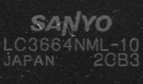
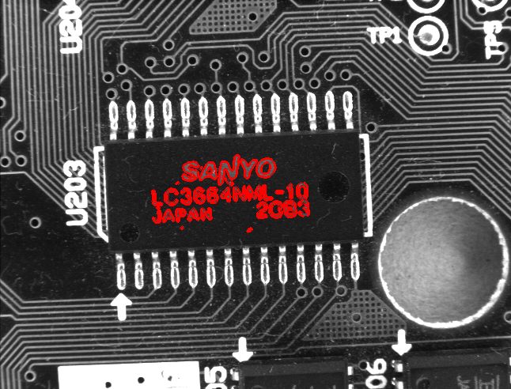

# Template match with shape/edge model

## highlights:
1. build model with [subpixel edge](https://www.ipol.im/pub/art/2017/216/)
2. compute score method: dot product(original) to lookup table of cos
3. we can build model only once at 0 degree in each level of pyramids with features 1. and 2.

## usage:
reference to main function

## gallery
model:

result:
